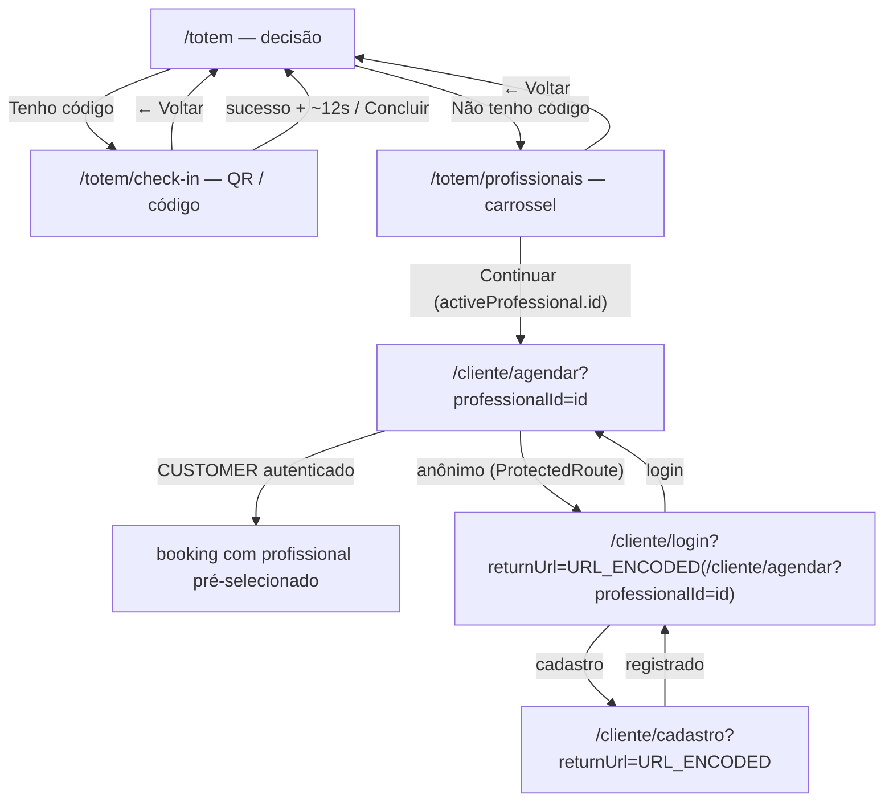

# LUMIS — Totem: separação em 3 telas + carrossel real de profissionais

**Status:** especificação final para revisão. Nenhuma implementação, migration, push, deploy ou alteração de banco nesta etapa.

**Branch:** `codex/reception-backend` (worktree `.worktrees/reception-backend`). HEAD no momento da escrita: `cbd16f0`.

**Escopo:** separar definitivamente a experiência do Totem em três telas com rotas próprias — `/totem` (decisão), `/totem/profissionais` (carrossel real) e `/totem/check-in` (fluxo QR/código já existente). Criar o backend público mínimo que alimenta o carrossel (`GET /api/totem/professionals` enriquecido + endpoint público de foto). Integrar a seleção do profissional ao fluxo de agendamento do `CUSTOMER`, preservando o `professionalId` através de login/cadastro via `returnUrl`.

**Fora do escopo (explícito):** walk-in; `Visit` criada só pela seleção; agendamento anônimo; WhatsApp/Resend/Intelbras; pagamento/financeiro; presença em tempo real (push); refactor global; limpeza de CSS legado; correção de CSP (tratada como pré-requisito separado — seção 20); alterações em `/api/totem/immediate`; qualquer mock, `Reception.tsx` dev, `AppStore`, `atrium_*`, fotos ou profissionais hardcoded.

---

## 1. Estado atual investigado (contratos a preservar)

Inspeção da branch `codex/reception-backend` em `cbd16f0`:

### 1.1 Backend

- **`recepcaototem/Features/Totem/TotemEndpoints.cs`** já expõe, todos `AllowAnonymous()`:
  - `GET /api/totem/professionals` → hoje retorna `TotemProfessionalResponse(Guid Id, string Name, string Profession, string? Description)` filtrando `WHERE IsActive` e ordenando por `NormalizedName`. **Nenhum consumidor no frontend** (`grep` em `ClientApp/src` não encontra chamada). Livre para enriquecer.
  - `GET /api/totem/availability`, `POST /api/totem/customers/resolve`, `POST /api/totem/reservations`, `POST /api/totem/check-in/resolve`, `POST /api/totem/check-in/confirm`, `POST /api/totem/presence/confirm`, `GET /api/totem/immediate` — **não serão alterados**.
- **`PresenceEvaluator.IsEffective(ProfessionalPresence? openPresence, IReadOnlyCollection<OperatingHourInterval> operatingHours, DateTimeOffset now, TimeZoneInfo zone)`** (`src/GestaoPredio.Application/Availability/PresenceEvaluator.cs`) — computação pura, sem estado. Retorna `true` quando existe presença aberta (`EndedAt == null`), iniciada no mesmo dia civil, e `now` (no fuso) `<=` último `ClosesAt` do dia da semana em `OperatingHours`. Fail‑closed quando não há expediente configurado para o dia. Já é reutilizado por `TotemEndpoints.ConfirmPresence`, `TotemEndpoints.Immediate` e `ReceptionEndpoints.Professionals`. **Esta é a regra de "presença efetiva + estabelecimento aberto" que o carrossel deve reutilizar — não duplicar.**
- **`ReceptionEndpoints.Professionals`** (`recepcaototem/Features/Reception/ReceptionEndpoints.cs`) já calcula um `operational` status por profissional combinando `Visits` abertas (`VisitStatus.InService` / `Waiting`), `IsActive`, disponibilidade de sala e `PresenceEvaluator`. Serve de referência; **não será chamado nem estendido** (é rota `RequireAuthorization` e mistura conceito de "atender agora").
- **`GestaoPredio.Domain.Visits.VisitStatus`** = `{ Waiting, InService, Ended, Cancelled }`.
- **`Professional`** (`src/GestaoPredio.Domain/Professionals/Professional.cs`): `Id`, `Name`, `NormalizedName`, `Profession`, `Description?`, `WhatsApp`, `PhotoFileId: Guid?`, `ApplicationUserId: string?`, `IsActive: bool`. Sem campo `Status`.
- **Foto do profissional:** armazenada em `IPrivateFileStorage` (privado), metadados em `db.PrivateFiles` com `Purpose == PrivateFilePurposes.ProfessionalPhoto` (`"PROFESSIONAL_PHOTO"`). Servida hoje **somente** por:
  - `GET /api/admin/professionals/{id}/photo` — `RequireAuthorization("Operations")`, `Cache-Control: private, no-store`. Handler `ProfessionalPhotoEndpoints.Get` (`internal static`, já reutilizável).
  - `GET /api/professional/me/photo` — o próprio profissional autenticado.
  - Não há superfície pública para a foto.
- **`CustomerPublicRateLimiter`** (`recepcaototem/Features/Customers/CustomerPublicRateLimiter.cs`): `AcquireAsync(string ip, string identifier, CancellationToken)` → lease com `.IsAcquired`. Limites configuráveis: `RateLimiting:CustomerIpPermitLimit` (default 30) e `RateLimiting:CustomerIdentifierPermitLimit` (15) por `RateLimiting:CustomerWindowSeconds` (60). Já usado por todos os endpoints públicos do Totem que fazem escrita.
- **CSP** definida em `recepcaototem/Program.cs:141` como header único:
  `default-src 'self'; script-src 'self'; style-src 'self' 'unsafe-inline'; img-src 'self' data: blob:; connect-src 'self'; media-src 'self' blob:; object-src 'none'; base-uri 'self'; frame-ancestors 'none'`.
  **Sem `font-src` e sem `worker-src`.** Não será alterada nesta spec (seção 20).

### 1.2 Frontend

- **`react-router-dom`** presente. **Nenhuma biblioteca de carrossel** (`embla`, `swiper`, `keen-slider` ausentes). CSP bloqueia scripts externos. O carrossel e todos os efeitos "Magic UI" serão **componentes locais** (CSS + JS mínimo), sem dependência nova.
- **`src/App.tsx`** (`ProductionApp`) — em `cbd16f0` tem `<Route path="/totem" element={<TotemCheckIn />} />` **e** `<Route path="/totem/check-in" element={<TotemCheckIn />} />`. **`src/dev/DevelopmentApp.tsx`** espelha as duas.
- **`src/frontend-portals.test.ts`** já contém (adicionado em `cbd16f0`):
  `expect(source).toContain('<Route path="/totem" element={<TotemCheckIn />} />')` para as duas árvores. **Este teste passará a falhar** e precisa ser atualizado (seção 22.3).
- **`src/pages/TotemCheckIn.tsx`** (`cbd16f0`): shell de kiosk dark de duas colunas. Preserva `useQrScanner`, `normalizeToken`, `totemApi.resolveCheckIn`, `totemApi.confirmCheckIn`, preview, `errorFor` (429), fallback câmera→manual, `Modal` de sucesso, `KioskClock`, auto‑retorno via `AUTO_RESET_MS` (12 s) que hoje chama `reset()` (permanece em `/totem/check-in`). **Sem** `← Voltar`.
- **`src/features/totem/KioskClock.tsx`** (`cbd16f0`): relógio `HH:mm` + dia/data em `America/Porto_Velho`, `setInterval` de 20 s limpo no unmount. Teste `KioskClock.test.tsx` já cobre "sem leak". **Reutilizar. Não criar outro timer.**
- **`src/pages/Login.tsx`**: **não** lê `returnUrl`, `?redirect`, nem `location.state`. Sempre `navigate(homeForRoles(current.roles), { replace: true })` após login (`/cliente` para `CUSTOMER`). Renderiza link `<a href="/cliente/cadastro">` para cadastro.
- **`src/components/ProtectedRoute.tsx`**: em `status === 'anonymous'` → `<Navigate to={location.pathname.startsWith('/cliente') ? '/cliente/login' : '/login'} state={{ from: location.pathname }} replace />`. Passa **apenas `location.pathname`**, sem `location.search` — um `?professionalId=` seria perdido. Contém a string exata `"location.pathname.startsWith('/cliente') ? '/cliente/login' : '/login'"` que `frontend-portals.test.ts` verifica; a string deve continuar presente.
- **`src/pages/customer/CustomerRegister.tsx`**: após `customerApi.register(...)` faz `navigate('/cliente/login', { replace: true, state: { registered: true } })`. **Não** auto‑loga.
- **`src/pages/customer/CustomerBooking.tsx`** (rota `/cliente/agendar`): carrega `customerApi.professionals()` e **auto‑seleciona `items[0]`**. Seleção por `<select>`. **Não lê nenhum query param.**
- **`src/auth/roleRoutes.ts`** `homeForRoles`: `CUSTOMER → /cliente`.
- **`src/pages/Reception.tsx`** (dev‑only, roteado só em `DevelopmentApp`): carrossel mock com classes `lumis-gallery*`, `useAppStore`, `atrium_*`, fotos hardcoded. **Referência de interação apenas** (padrão de scroll‑snap nativo no touch + pointer‑drag só para mouse + flag `didDrag` para suprimir o clique pós‑arraste). **Nenhum código, classe ou dado será reutilizado.**
- **`scripts/verify-production-bundle.mjs`**: falha se o `manifest.json` referenciar `src/dev/`, `AppStore`, `src/data/mock`, ou se o JS emitido contiver `atrium_professionals|atrium_rooms|atrium_leases|atrium_visits|atrium_settings` ou `localhost:5218|localhost:7266`.

---

## 2. Novo fluxo oficial



Regras do fluxo:

- A decisão "tenho / não tenho código" é resolvida **uma vez** em `/totem`. Depois de escolher um profissional, **não** reaparecem as perguntas "Já tenho agendamento" / "Quero agendar".
- `/totem/profissionais` é dedicada **somente** à escolha do profissional. Sem QR, sem campo de código, sem opções extras.
- `/totem/check-in` continua sendo o fluxo real, sem duplicação de lógica.
- Após sucesso de check‑in, o kiosk retorna para **`/totem`** (não fica preso em `/totem/check-in`).
- Nesta rodada **não** há criação de booking anônimo; um visitante sem conta é levado a `/cliente/login` (ou cadastro) e retorna ao booking com o profissional preservado.

---

## 3. Rotas finais

`ProductionApp` (`src/App.tsx`) e `DevelopmentApp` (`src/dev/DevelopmentApp.tsx`) — ambas as árvores:

| Rota | Componente | Proteção | Observação |
|---|---|---|---|
| `/` | `<Home />` | pública | inalterada |
| `/totem` | `<TotemEntry />` | pública | **NOVO** — tela de decisão |
| `/totem/profissionais` | `<TotemProfessionals />` | pública | **NOVO** — carrossel |
| `/totem/check-in` | `<TotemCheckIn />` | pública | fluxo existente + `← Voltar` + auto‑retorno para `/totem` |
| `/cliente/agendar` | `<CustomerBooking />` | `ProtectedRoute allowedRoles={['CUSTOMER']}` | lê **apenas** `?professionalId` |

O catch‑all `<Route path="*" element={<Navigate to="/" replace />} />` permanece.

---

## 4. Tela 1 — `/totem` (`TotemEntry`)

**Objetivo:** perguntar apenas como a pessoa deseja continuar. Layout de **coluna central única** (não é o shell de duas colunas do check‑in).

### 4.1 Estrutura

```
[ LightRays background ]                (decorativo, pointer-events:none, aria-hidden)

        LUMIS                           (logo /lumis-logo-transparent.png)

        BEM-VINDO                       (eyebrow)

        Como deseja continuar?         (h1)

   ┌───────────────────────┐
   │      [ícone QR]        │            MagicCard + RippleButton
   │     Tenho código      │            → navigate('/totem/check-in')
   └───────────────────────┘

   ┌───────────────────────┐
   │    [ícone pessoa]      │            MagicCard + RippleButton
   │   Não tenho código    │            → navigate('/totem/profissionais')
   └───────────────────────┘

   Toque em uma opção para continuar.   (uma linha de apoio, opcional)

   ─────────────────────────
   19:03                                (KioskClock — rodapé)
   Quarta-feira, 09 de setembro
```

### 4.2 Regras

- Copy **exata**: eyebrow `Bem-vindo`; título `Como deseja continuar?`; cartões `Tenho código` e `Não tenho código`; linha de apoio (única, opcional) `Toque em uma opção para continuar.`. **Nenhum parágrafo** explicando o sistema.
- Cada cartão é um `<button type="button">` real (alvo ≥ 128 px de altura), com ícone (`lucide-react`: `QrCode` e `UserRound`), rótulo grande, `aria-label` explícito.
- `Tenho código` → `navigate('/totem/check-in')`. `Não tenho código` → `navigate('/totem/profissionais')`.
- `KioskClock` no rodapé. **Sem novo timer.**
- `BlurFade` encadeia a entrada de: logo → título → cartão 1 → cartão 2 (curto, só no mount).
- `LightRays` no fundo.
- Sem QR, sem campo de código, sem relógio duplicado.

---

## 5. Tela 2 — `/totem/profissionais` (`TotemProfessionals`)

**Objetivo:** escolher **um** profissional e continuar para o agendamento. Layout de **barra superior** (logo à esquerda, relógio à direita) + conteúdo central.

### 5.1 Estrutura

```
[ LightRays background ]

 LUMIS                                   19:03  (KioskClock na barra superior)
                                         Quarta-feira, 09 de setembro

              Escolha o profissional     (h1, única frase)

  ProgressiveBlur ‹  ┌───────────┐  › ProgressiveBlur
   (borda esq.)      │   FOTO    │      (borda dir.)
        [card]       │           │      [card]        cards vizinhos parcialmente visíveis
                     │ Dra. …    │
                     │ Fisioter. │
                     │ ● Disponí.│      BorderBeam só no card central/selecionado
                     └───────────┘
                        ● ○ ○ ○          (dots — reflete o card central)

              [   Continuar →   ]        RippleButton — usa activeProfessional.id

              ← Voltar                   → navigate('/totem')
```

### 5.2 Card do profissional

Mostra **apenas**: foto (ou fallback de iniciais), nome, profissão, status (dot + texto). **Nada** de telefone, e‑mail, WhatsApp, descrição, dados administrativos ou textos longos.

```
[FOTO ou "HS"]
Dra. Helena Smoke
Fisioterapeuta
● Disponível
```

- Cada card é `<button type="button" role="option" aria-selected={i === activeIndex} aria-label="{nome}, {profissão}, {statusLabel}">`.
- Foto: ``; em erro ou `photoUrl == null` renderiza o fallback de iniciais (bloco com as iniciais do nome, mesmo tamanho da foto). **Nunca deixar imagem quebrada.**
- Card central recebe `.is-active` → `transform: scale(1.06)` + `BorderBeam`. Vizinhos parcialmente visíveis via `padding-inline` do trilho + `gap`.

### 5.3 Status (texto + cor, nunca só cor)

| `status` (backend) | Rótulo | Cor (token) |
|---|---|---|
| `AVAILABLE` | `Disponível` | verde `--totem-ok: #3E9B6B` |
| `IN_SERVICE` | `Em atendimento` | âmbar `--totem-busy: #C98A2B` |
| `UNAVAILABLE` | `Indisponível` | cinza `--totem-muted: #888888` |

O chip sempre traz **dot colorido + texto**. Profissional `IsActive` porém `UNAVAILABLE` **continua aparecendo** no carrossel (o visitante ainda pode agendar para outro horário). Profissional com `IsActive == false` **não aparece**.

### 5.4 Continuar

- Botão `Continuar →` (`RippleButton`). Habilitado assim que há dados (há sempre um card central após o load).
- Ao tocar: `navigate('/cliente/agendar?professionalId=' + activeProfessional.id)`, usando **exatamente `activeProfessional.id`** (o id do card centralizado no momento do toque).
- **Nenhum parâmetro de origem/analytics.** A URL é somente `?professionalId=<id>`.

### 5.5 Voltar

`← Voltar` (control discreto) → `navigate('/totem')`.

---

## 6. Tela 3 — `/totem/check-in` (`TotemCheckIn`)

**Preservar** (fluxo e chamadas): `useQrScanner`, câmera, "Escanear QR", `totemApi.resolveCheckIn`, `totemApi.confirmCheckIn`, preview, `errorFor` (429), fallback câmera→manual, `useEffect(() => stop, [stop])`, `Modal` de sucesso, `KioskClock`, `AUTO_RESET_MS`, `normalizeToken` (aplicado só ao caminho do QR). **Nenhum contrato de backend muda.**

Mudanças de apresentação/navegação:

1. **`← Voltar`** — control discreto no shell → `navigate('/totem')`. É navegação; não toca no estado do fluxo.
2. **Auto‑retorno e "Concluir" vão para `/totem`.** Hoje o `setTimeout(reset, AUTO_RESET_MS)` e o botão "Concluir" mantêm o usuário em `/totem/check-in`. Passam a `navigate('/totem')` (o `reset()` continua limpando o estado interno antes de navegar; o `setTimeout`/`clearTimeout` continua sendo o mesmo, sem novo timer).
3. **Menos texto.** O painel lateral deixa de exibir eyebrow "Bem-vindo", headline e parágrafo. Passa a mostrar **apenas** `LUMIS` + `KioskClock`. Área principal mantém `Confirme sua chegada`, as duas opções e **somente** as instruções necessárias. `LightRays` substitui o feixe ad‑hoc.

Mudança de comportamento no caminho manual (detalhado na **seção 7A.7**):

4. **"Digitar código" passa a ser entrada de 6 dígitos.** O input livre "Cole ou digite o código" vira uma entrada numérica de **exatamente 6 dígitos** (`inputMode="numeric"`, só dígitos, zeros à esquerda preservados, paste, botão desabilitado com < 6, Enter quando 6). O token forte continua **apenas** por "Escanear QR" (câmera). O `resolveToken`/`confirmManually` continuam chamando `totemApi.resolveCheckIn`/`confirmCheckIn` com a string digitada — quem distingue "6 dígitos = código manual" vs "token forte" é o **backend** (seção 7A.6), não o frontend. Auto‑confirm continua **só** para `source === 'scan'`.

---

## 7. Backend — `GET /api/totem/professionals` (enriquecido) + foto pública

### 7.1 DTO próprio e mínimo (minimização de dados)

Novo record em `TotemEndpoints.cs`, **exatamente 5 campos** e nada além disso:

```csharp
public sealed record TotemProfessionalCard(
    Guid Id,
    string Name,
    string Profession,
    string? PhotoUrl,
    string Status);   // "AVAILABLE" | "IN_SERVICE" | "UNAVAILABLE"
```

- `PhotoUrl` = `p.PhotoFileId is null ? null : $"/api/totem/professionals/{p.Id}/photo"`.
- **Sem `Description` no DTO público do carrossel.** **Nunca** retorna: `Description`, `WhatsApp`, `ApplicationUserId`, qualquer id de Identity, e‑mail, telefone, CPF, contratos, financeiro, auditoria, `PhotoFileId` cru, dados internos.
- Não reutiliza `ReceptionProfessionalResponse`, `CustomerProfessionalResponse` nem `ProfessionalResponse` administrativo.
- **Contrato separado preservado:** `/api/totem/immediate` continua usando `TotemProfessionalResponse(Guid Id, string Name, string Profession, string? Description)` **sem alteração**. Os dois records coexistem como tipos distintos; a existência de `Description` num contrato pré‑existente não justifica incluí‑la no DTO novo, que segue minimização de dados.

### 7.2 Handler `Professionals` (substitui o corpo atual)

```
GET /api/totem/professionals   [AllowAnonymous]
```

Passos:

1. Rate limiting: `CustomerPublicRateLimiter.AcquireAsync(ip, "totem-professionals", ct)`; se `!IsAcquired` → `429` `ApiError("TOO_MANY_REQUESTS", …)` (mesmo padrão dos demais endpoints públicos do Totem).
2. `professionals = db.Professionals.AsNoTracking().Where(x => x.IsActive).OrderBy(x => x.NormalizedName).Select(x => new { x.Id, x.Name, x.Profession, x.PhotoFileId }).ToListAsync(ct)`.
3. Se vazio → `Results.Ok(Array.Empty<TotemProfessionalCard>())`.
4. `ids = professionals.Select(x => x.Id)`.
5. `inServiceIds = (await db.Visits.AsNoTracking().Where(v => ids.Contains(v.ProfessionalId) && v.Status == VisitStatus.InService).Select(v => v.ProfessionalId).Distinct().ToListAsync(ct)).ToHashSet()`.
6. `operatingHours = db.OperatingHourIntervals.AsNoTracking().ToListAsync(ct)`.
7. `openPresences = db.ProfessionalPresences.AsNoTracking().Where(x => ids.Contains(x.ProfessionalId) && x.EndedAt == null).ToListAsync(ct)`; agrupar por `ProfessionalId`, pegar a de maior `StartedAt`.
8. `now = time.GetUtcNow()`.
9. Para cada profissional, `status = TotemProfessionalStatus.Resolve(inService: inServiceIds.Contains(id), effectivePresence: PresenceEvaluator.IsEffective(presenceOrNull, operatingHours, now, timeZone))`.
10. `Results.Ok(cards)` na ordem de `NormalizedName`.

Sem transação (leitura pura). Sem paginação (lista curta de profissionais ativos). Sem parâmetros de query (sem consultas arbitrárias).

### 7.3 Regra de status — mapeador puro (seção 8)

Extrair função pura testável:

```csharp
// recepcaototem/Features/Totem/TotemProfessionalStatus.cs
public static class TotemProfessionalStatus
{
    public static string Resolve(bool inService, bool effectivePresence) =>
        inService ? "IN_SERVICE" :
        effectivePresence ? "AVAILABLE" :
        "UNAVAILABLE";
}
```

### 7.4 Endpoint público de foto (menor superfície possível)

```
GET /api/totem/professionals/{id:guid}/photo   [AllowAnonymous]
```

**Decisão de status codes (aprovada):**
- **`404`** somente para: profissional inexistente; profissional `!IsActive`; `PhotoFileId is null`; `Purpose` do `PrivateFiles` ≠ `ProfessionalPhoto`.
- **`503`** para **falha real de I/O/storage** — `IPrivateFileStorage.OpenReadAsync` lança `IOException`/`UnauthorizedAccessException`/`ArgumentException`, ou o stream falha integridade (`null`, `!CanSeek`, `Length != metadata.Length`). Esse é exatamente o comportamento histórico de `ProfessionalPhotoEndpoints.Get` (`PhotoUnavailable` → `503`), preservado pelo helper compartilhado para **os dois** callers. **Não** forçar `404` para indisponibilidade de storage.

Sequência:
- `404` nos quatro casos acima (o log "photo unavailable" cobre o caso de `Purpose` divergente).
- Headers: `Content-Type: metadata.MimeType`; `X-Content-Type-Options: nosniff`; `Content-Disposition: inline`; **`Cache-Control: public, max-age=300`** (decisão: é o retrato de um profissional agendável exibido em kiosk público; 5 min equilibra desempenho do carrossel e atualização de foto).
- **Sem rate limiting** neste GET (comportamento de asset estático: sem efeito colateral, `img-src 'self'` já cobre, integridade verificada, só profissionais ativos). Um carrossel carrega várias fotos por render; aplicar o limitador por IP quebraria a tela.
- **Reuso sem duplicação:** extrair a lógica de streaming de `ProfessionalPhotoEndpoints.Get` para um helper `internal static` (novo arquivo `recepcaototem/Features/Professionals/ProfessionalPhotoStreaming.cs`, ex. `StreamAsync(Professional professional, ApplicationDbContext db, IPrivateFileStorage storage, ILoggerFactory loggerFactory, HttpContext context, string cacheControl, CancellationToken ct)`). O endpoint admin passa a chamá‑lo com `cacheControl = "private, no-store"`; o endpoint do Totem chama com `"public, max-age=300"`. Nenhuma mudança de comportamento no endpoint admin além do refactor.
- **Não** torna o storage inteiro público: só serve bytes de foto de profissional **ativo**, id → foto própria, sem listagem, sem acesso a arquivo arbitrário, sem outros `Purpose`.

### 7.5 Registro de rotas

Em `MapTotemEndpoints`:

```csharp
endpoints.MapGet("/api/totem/professionals", Professionals).AllowAnonymous();          // corpo substituído
endpoints.MapGet("/api/totem/professionals/{id:guid}/photo", ProfessionalPhoto).AllowAnonymous(); // novo
```

---

## 7A. Credencial de check-in — QR forte + código manual de 6 dígitos

### 7A.1 Estado atual investigado (a base a reutilizar, não duplicar)

- **Entidade** `GestaoPredio.Domain.Customers.CheckInToken` (`src/GestaoPredio.Domain/Customers/CheckInToken.cs`):
  `Id`, `ReservationId`, `TokenHash: byte[]` (SHA‑256, 32 bytes), `IssuedAt`, `ExpiresAt`, `RevokedAt?`, `UsedAt?`, `Version` (xmin rowversion).
  Métodos: `Create(reservationId, tokenHash[32], issuedAt, expiresAt)`, `Revoke(at)`, `MarkUsed(at)`, `Rotate(tokenHash[32], issuedAt, expiresAt)` — `Rotate` **substitui o hash e zera `RevokedAt`/`UsedAt`**.
- **Configuração EF** (`CheckInTokenConfiguration.cs`): tabela `CheckInTokens`; `TokenHash bytea NOT NULL`; **índice único** `UX_CheckInTokens_TokenHash`; **índice único** `UX_CheckInTokens_ReservationId` ⇒ **exatamente uma linha `CheckInToken` por reserva**; FK → `Reservation` `NoAction`.
- **Emissão** `POST /api/customer/reservations/{id}/check-in-token` (`CustomerSchedulingEndpoints.IssueToken`, `RequireAuthorization` cliente + `AntiforgeryFilter`):
  - Gate de elegibilidade: `reservation.Status == Approved` **e** `reservation.EndAt > now` **e** `now >= reservation.StartAt - 1h` (senão `400 CHECK_IN_NOT_ELIGIBLE`).
  - `raw = RandomNumberGenerator.GetBytes(32)`; `hash = SHA256.HashData(raw)`.
  - Uma linha por reserva: **primeira** chamada → `CheckInToken.Create`; **chamadas seguintes** → `token.Rotate(hash, now, reservation.EndAt)` (**o botão "Gerar QR Code" já ROTACIONA** — o token anterior deixa de resolver imediatamente).
  - `ExpiresAt = reservation.EndAt` (não há TTL fixo).
  - Resposta atual: `{ token: Base64Url(raw), expiresAt: reservation.EndAt }`.
  - Auditoria: `CHECK_IN_TOKEN_ISSUED`, alvo `RESERVATION` — **sem valor do token**.
- **Resolve/Confirm** `POST /api/totem/check-in/resolve` e `/confirm` (`TotemEndpoints`, ambos `AllowAnonymous` + `CustomerPublicRateLimiter`):
  - Núcleo `FindCheckIn(raw, db, time, ct)`: `Base64UrlDecode(raw)` → exige 32 bytes → `SHA256.HashData` → join `CheckInTokens × Reservations × Customers × Professionals × Rooms` por `TokenHash`.
  - Gate: `RevokedAt == null` **e** `ExpiresAt > now` **e** `reservation.Status == Approved` **e** `customer.IsActive` **e** `now >= StartAt - 1h` **e** `now < EndAt`. Retorna `(CheckInToken token, Reservation, Customer, TotemCheckInPreview)` ou `null`.
  - `ResolveCheckIn`: `null → 400 INVALID_CHECK_IN`; senão `Ok(preview)`.
  - `ConfirmCheckIn`: transação → `FindCheckIn` → se já existe `Visit` `Waiting`/`InService` para a reserva → retorna essa (**idempotente**) → senão se `token.UsedAt != null` → `400 INVALID_CHECK_IN` → senão `Visit.Arrive(...)` + `token.MarkUsed(now)` + auditoria `VISIT_CHECKED_IN` + notifica profissional. Retorna `{ visitId, status: "WAITING" }`.
- **Revogação em cancelamento/remarcação:** `ReservationCheckInTokenRevocation.RevokeAsync(db, reservationId, now, ct)` → `token?.Revoke(now)`. Chamada por: cancelamento do cliente, remarcação do cliente (que cria **nova** `Reservation` sem `CheckInToken`), e pelos fluxos de decisão de reserva e de presença profissional.
- **Frontend cliente** `CustomerReservationDetail.tsx`: botão **"Gerar QR Code"** → `customerApi.issueCheckInToken(id)` → estado local `token`/`expiresAt` → `QRCode.toDataURL(result.token)`. **Não** emite no mount; recarregar a página perde o estado e o cliente clica de novo (→ `Rotate`). `frontend-portals.test.ts` verifica `QRCode.toDataURL(result.token` e ausência de `localStorage|sessionStorage`.
- **Testes existentes:** `tests/GestaoPredio.UnitTests/CheckInTokenTests.cs`, `tests/GestaoPredio.IntegrationTests/{CustomerApiTests,ReservationWorkflowTests,TotemPresenceApiTests}.cs`.

### 7A.2 QR e código são a MESMA credencial

**Decisão (aprovada):** o token forte do QR e o código manual de 6 dígitos são **duas representações da mesma credencial** — a única linha `CheckInToken` da reserva. `IssuedAt`, `ExpiresAt`, `RevokedAt`, `UsedAt` são **compartilhados**. Consequências, todas automáticas por serem a mesma linha:

- Check‑in por **qualquer um** dos dois → `token.MarkUsed(now)` na linha → o **outro** para de resolver (gate `UsedAt`/`FindCheckIn`).
- **Rotacionar** (nova chamada a `IssueToken`) substitui **os dois** hashes e zera `RevokedAt`/`UsedAt` → QR antigo **e** código antigo morrem juntos.
- **Cancelar/remarcar** → `Revoke` na linha → os dois inválidos. Remarcação cria nova reserva sem `CheckInToken` → nova credencial só quando o cliente solicitar.

### 7A.3 Representação do `manualCode`

Novo value object `GestaoPredio.Domain.Customers.ManualCheckInCode`:

```csharp
public readonly struct ManualCheckInCode
{
    public string Value { get; }               // exatamente 6 caracteres [0-9], zeros à esquerda preservados
    private ManualCheckInCode(string value) => Value = value;

    public static ManualCheckInCode Generate()
    {
        // CSPRNG uniforme; System.Security.Cryptography.RandomNumberGenerator.GetInt32 usa rejeição.
        var n = System.Security.Cryptography.RandomNumberGenerator.GetInt32(0, 1_000_000);
        return new ManualCheckInCode(n.ToString("D6", System.Globalization.CultureInfo.InvariantCulture));
    }

    public static bool TryParse(string? raw, out ManualCheckInCode code)
    {
        code = default;
        var t = raw?.Trim() ?? string.Empty;
        if (t.Length != 6) return false;
        foreach (var c in t) if (c is < '0' or > '9') return false;
        code = new ManualCheckInCode(t);
        return true;
    }

    public byte[] Hash() =>
        System.Security.Cryptography.SHA256.HashData(System.Text.Encoding.ASCII.GetBytes(Value));

    public override string ToString() => Value;
}
```

- **Nunca `int`.** `string` de 6 dígitos preserva `"004821"`.
- RNG: `RandomNumberGenerator.GetInt32` (criptográfico, uniforme por rejeição).
- Hash: **SHA‑256 do texto ASCII de 6 dígitos**, 32 bytes — mesmo padrão de `TokenHash`. Tradeoff registrado em **7A.9**.

### 7A.4 Persistência — estender `CheckInToken` (sem tabela nova)

Extensão limpa da entidade e da configuração (não cria tabela):

- `CheckInToken`: novo campo `public byte[]? ManualCodeHash { get; private set; }`.
- `Create` e `Rotate` ganham o parâmetro `byte[] manualCodeHash` (32 bytes, obrigatório em emissões novas). Assinaturas:
  - `Create(Guid reservationId, byte[] tokenHash, byte[] manualCodeHash, DateTimeOffset issuedAt, DateTimeOffset expiresAt)`
  - `Rotate(byte[] tokenHash, byte[] manualCodeHash, DateTimeOffset issuedAt, DateTimeOffset expiresAt)` — substitui **ambos** os hashes, zera `RevokedAt`/`UsedAt`.
  - Validação: `manualCodeHash?.Length == 32` (mesma regra de `tokenHash`).
- EF (`CheckInTokenConfiguration`): `Property(x => x.ManualCodeHash).HasColumnType("bytea")` (**nullable**); `HasIndex(x => x.ManualCodeHash).IsUnique().HasFilter("\"ManualCodeHash\" IS NOT NULL").HasDatabaseName("UX_CheckInTokens_ManualCodeHash")` — **índice único parcial** (único entre linhas com `ManualCodeHash` não nulo).
- **Migration:** exigida — **documentada na seção 26**, **não criada nesta etapa**.

### 7A.5 Unicidade / colisão

Espaço de apenas 1.000.000 combinações. Garantias divididas:

- **No banco (garantia dura):** `UX_CheckInTokens_ManualCodeHash` (único parcial, não nulo) ⇒ um hash de código manual mapeia para **no máximo uma** linha `CheckInToken` em qualquer instante — **resolução nunca ambígua**. Isso vale para **todas** as linhas (ativas, revogadas, usadas, expiradas): uma linha revogada/usada ainda "reserva" seu hash até ser rotacionada.
  - Índice **parcial** (`WHERE "ManualCodeHash" IS NOT NULL`) porque linhas pré‑migration têm `ManualCodeHash = NULL` (a condição "ativo/não expirado" **não** cabe num índice: `now()` não é imutável no PostgreSQL).
- **Na aplicação (garantia de UX + concorrência):** loop de geração em `IssueToken`:
  1. `ManualCheckInCode.Generate()` (CSPRNG).
  2. `hash = code.Hash()`.
  3. Consulta: existe **outra** linha `CheckInToken` com `ManualCodeHash == hash` **e ainda resolvível** (`RevokedAt == null && UsedAt == null && ExpiresAt > now`)? Se sim → colisão → tenta de novo.
  4. `SaveChanges`: se um emissor concorrente pegou o mesmo valor, o `UPDATE`/`INSERT` viola `UX_CheckInTokens_ManualCodeHash` → `DbUpdateException` → captura → tenta de novo.
  5. **Máximo 5 tentativas.** Excedido → `Results.Json(new ApiError("CHECK_IN_CODE_UNAVAILABLE", "Não foi possível gerar o código agora. Tente novamente."), statusCode: 503)` + auditoria `CHECK_IN_TOKEN_ISSUE_FAILED` (**sem** valor). Com poucas centenas de credenciais ativas contra 1M, P(colisão) por tentativa < 0,001; exaustão de 5 tentativas é praticamente impossível.
- **Escopo de unicidade adotado:** unicidade **entre códigos ainda resolvíveis** (a garantia do banco é mais forte — global — e é o backstop; a condição "resolvível" é aplicada na consulta da app + no gate de resolve).

### 7A.6 Resolve — endpoint único, regra única

`POST /api/totem/check-in/resolve` `{ token }` — **forma do request/response inalterada**. O handler despacha por **forma da string**:

```
raw = (request.Token ?? "").Trim()
se ManualCheckInCode.TryParse(raw, out code)  →  lookup por ManualCodeHash == code.Hash()
senão                                         →  caminho atual: Base64UrlDecode → 32 bytes → SHA256 → lookup por TokenHash
```

- `FindCheckIn` passa a receber "por qual hash procurar", mas o **restante é idêntico**: mesmos joins, **mesmo gate de elegibilidade**, mesmo retorno `(CheckInToken, Reservation, Customer, TotemCheckInPreview)`. **Não há segundo conjunto de regras.**
- `ManualCodeHash == null` (linha pré‑migration) nunca casa com um input de 6 dígitos.
- Um token forte é Base64Url de 32 bytes (43 chars) — **nunca** 6 dígitos; sem ambiguidade de despacho.
- `ConfirmCheckIn` usa o **mesmo despacho** e o **mesmo `FindCheckIn`**; idempotência, criação de `Visit` e `MarkUsed` inalterados.
- **Resposta pública para código manual inválido/expirado/consumido/inexistente:** `400` `ApiError("INVALID_CHECK_IN", "Não foi possível validar este código.")`. **Sem** distinguir "existe mas expirou" / "existe mas foi usado" / reserva específica / qualquer dado antes de uma resolução elegível — mesma não‑divulgação que o caminho do token forte.

### 7A.7 Emissão / exibição

`IssueToken` (mesmo gate de elegibilidade atual — **reutilizado, não duplicado**):

1. Gera token forte (atual: 32 bytes CSPRNG → SHA‑256).
2. Gera `ManualCheckInCode` com o loop da **7A.5** → `manualCodeHash`.
3. Linha única da reserva: `Create(id, tokenHash, manualCodeHash, now, reservation.EndAt)` **ou** `Rotate(tokenHash, manualCodeHash, now, reservation.EndAt)`.
4. Auditoria `CHECK_IN_TOKEN_ISSUED` inalterada — **sem** token, **sem** código.
5. Resposta **enriquecida**: `{ token: "<base64url>", manualCode: "482731", expiresAt: "<reservation.EndAt>" }`.

- **Plaintext do `manualCode` só nessa resposta.** Nunca persistido, nunca logado, nunca auditado.
- **Contrato:** adição do campo `manualCode` (aditivo). Consumidor único hoje: `CustomerReservationDetail.tsx` (`result.token` → QR; passa a usar também `result.manualCode`). `customerApi.issueCheckInToken` muda o tipo de retorno para `{ token: string; manualCode: string; expiresAt: string }`.

**Área do CUSTOMER (`CustomerReservationDetail.tsx`)** — texto mínimo:
```
QR Code
[imagem]

Código
4 8 2 7 3 1
Use este código no Totem.
```
Os 6 dígitos ficam em estado de componente pela sessão (sem storage). Recarregar perde → botão "Gerar QR Code" reemite (7A.8).

### 7A.8 Reload / reexibição — Estratégia A (aprovada)

O plaintext **não** é armazenado, logo **não é recuperável**. Reexibir = **reemitir**. O botão "Gerar QR Code" já rotaciona; passa a rotacionar **o par** (QR + código). O par anterior deixa de funcionar no instante da reemissão — **idêntico** à semântica de rotação do QR de hoje.

- **Não** persistir plaintext só para reexibir.
- Frontend: após emitir, QR e os 6 dígitos vivem em estado de componente pela sessão; no unmount/reload somem; o botão reemite.
- Rótulo do botão pode passar a "Gerar QR Code e código" (cosmético; não obrigatório).

### 7A.9 Rate limit / brute force

- `resolve` e `confirm` já usam `CustomerPublicRateLimiter` com chave `(ip, token)`. Orçamento efetivo: a **partição por IP** limita o total a `RateLimiting:CustomerIpPermitLimit` (**default 30 / 60 s**) **independentemente** de variar o palpite; a partição por identificador (15/60 s por hash de código distinto) é secundária.
- 1.000.000 combinações. A 30 palpites/min/IP, o número esperado de palpites para acertar **um código específico** ≈ 500.000 → ≈ **11,5 dias** de abuso contínuo em taxa máxima de um único IP — e o código expira em `reservation.EndAt` (horas). Abuso distribuído entre IPs é o risco residual aceito (sem CAPTCHA neste MVP, por decisão).
- **Decisão:** manter `CustomerPublicRateLimiter` como está (**não** afrouxar, **não** endurecer). Testes obrigatórios: N chamadas rápidas de `resolve` do mesmo IP → `429` no limite. Knob opcional documentado: baixar `RateLimiting:CustomerIpPermitLimit` (só config, sem código).
- **Hash SHA‑256 puro** do código de 6 dígitos: comprometimento do banco já é catastrófico (o atacante teria `Reservations`/`Customers`); o valor de um código manual roubado é baixo (fazer um check‑in). Ataque online é limitado pelo rate limit. Endurecimento opcional (fora do MVP): HMAC‑SHA‑256 com pepper do servidor.

### 7A.10 Logs / auditoria

- O plaintext dos 6 dígitos **nunca** aparece em `AuditEntries` (o audit de emissão continua sem valor) nem em `ILogger` (nenhuma interpolação do código em log). O gerador loga apenas contagem de tentativas / falha — nunca o valor.

---

## 8. Regra de status — decisão documentada

**Serviços/evaluators reutilizados (nenhuma regra nova):**

- `inService` ← existência de `Visit` com `Status == VisitStatus.InService` para o profissional (mesmo enum/consulta usados por `TotemEndpoints.ConfirmCheckIn` e `ReceptionEndpoints`).
- `effectivePresence` ← `PresenceEvaluator.IsEffective(openPresence, operatingHours, now, zone)` — já embute "presença aberta no mesmo dia civil" **+** "estabelecimento aberto agora (`now <= último ClosesAt`)". `openPresence` = linha mais recente de `ProfessionalPresences` com `EndedAt == null`.

**Mapa (função `TotemProfessionalStatus.Resolve`):**

| `inService` | `effectivePresence` | Resultado |
|:---:|:---:|:---|
| `true` | — | `IN_SERVICE` |
| `false` | `true` | `AVAILABLE` |
| `false` | `false` | `UNAVAILABLE` |

**Diferenças deliberadas vs. `ReceptionEndpoints.Professionals` (documentadas):**

- O carrossel **não** rebaixa para `UNAVAILABLE` por falta de sala livre agora (`hasUsableRoom`). A recepção responde "consegue atender **agora**?"; o carrossel responde "está trabalhando hoje, vale escolher para um horário **futuro**?". A disponibilidade de sala por slot é validada depois, no fluxo `CUSTOMER` (`IAppointmentAvailabilityService`).
- Visitante em fila (`VisitStatus.Waiting`, sem `InService`) **não** conta como `IN_SERVICE` — o profissional aparece como `AVAILABLE` se tiver presença efetiva. A regra do usuário é explícita: `IN_SERVICE` só com atendimento `InService` real.
- Fora do horário do estabelecimento no dia civil (ou expediente não configurado) → `effectivePresence == false` → `UNAVAILABLE`, independentemente de haver presença aberta.

---

## 9. Fotos

- Origem: `Professional.PhotoFileId` → `PrivateFiles` (`Purpose == "PROFESSIONAL_PHOTO"`) → `IPrivateFileStorage`.
- Superfície pública mínima: `GET /api/totem/professionals/{id}/photo` (seção 7.4). Só profissional ativo.
- Frontend: ``. `photoUrl == null` ou `onError` → bloco de **iniciais** (`professionalInitials(name)` → até 2 letras maiúsculas: primeira do primeiro nome + primeira do último; 1 palavra → 1 letra), mesmo tamanho/raio da foto, fundo `--totem-card-2`, texto `--totem-ink`.
- **Nunca** imagem quebrada visível.
- Não torna nenhum outro storage/endpoint público.

---

## 10. Integração `CUSTOMER` — `professionalId` através de login/cadastro

**Mecanismo: query param `?returnUrl=<URL_ENCODED>` com allowlist ESTRITA do portal do cliente.** Sobrevive a reload (ao contrário de `location.state`), funciona com link, é testável. `location.state.from` permanece por compatibilidade, mas o `returnUrl` **validado** é a fonte de verdade do destino pós‑login. **Não** se aceita "qualquer caminho interno" — somente rotas conhecidas sob `/cliente`.

### 10.1 Helper — validação estrita contra open redirect

```ts
// src/auth/returnUrl.ts
//
// Allowlist ESTRITA para redirecionamento pos-login no portal do cliente.
// Somente caminhos sob /cliente sao aceitos. Qualquer outra coisa -> null.
// Testes explicitos de open redirect acompanham (secao 22.2).

const hasControlChar = (s: string) =>
  [...s].some((c) => { const n = c.charCodeAt(0); return n < 0x20 || (n >= 0x7f && n <= 0x9f) })
const CUSTOMER_PATH = /^\/cliente(?:\/[A-Za-z0-9_-]+)*\/?$/    // /cliente  ou  /cliente/<segmentos>
const CUSTOMER_QUERY = /^[A-Za-z0-9_-]+=[A-Za-z0-9_-]*(?:&[A-Za-z0-9_-]+=[A-Za-z0-9_-]*)*$/  // pares chave=valor seguros

export function safeCustomerReturnUrl(raw: string | null | undefined): string | null {
  if (!raw || typeof raw !== 'string') return null
  if (raw.length > 512) return null
  if (hasControlChar(raw)) return null

  // Colapsa qualquer nivel de encoding (defesa contra %252F..., %25252F..., etc.).
  let value = raw
  for (let i = 0; i < 4; i++) {
    let next: string
    try { next = decodeURIComponent(value) } catch { return null }
    if (next === value) break
    value = next
  }

  if (hasControlChar(value)) return null
  if (value.includes('\\')) return null       // backslash / \evil
  if (value.includes('%')) return null         // ainda encoded apos 4 decodes -> suspeito
  if (value.includes('://')) return null       // http:// https:// qualquer esquema
  if (value.includes('..')) return null        // traversal
  if (value.startsWith('//')) return null       // protocol-relative //evil.com
  if (!value.startsWith('/cliente')) return null

  const q = value.indexOf('?')
  const path = q === -1 ? value : value.slice(0, q)
  const query = q === -1 ? '' : value.slice(q + 1)
  if (query.includes('?')) return null          // um unico '?'
  if (path.includes('//')) return null
  if (!CUSTOMER_PATH.test(path)) return null
  if (query && !CUSTOMER_QUERY.test(query)) return null

  return query ? `${path}?${query}` : path
}
```

**Rejeita** (teste explícito para cada — seção 22.2): `null` / `undefined` / string vazia; URLs absolutas; `http://` / `https://` / qualquer `<esquema>://`; `//evil.com` (protocol‑relative); `/\evil` e qualquer `\`; caracteres de controle (U+0000..U+001F, U+007F..U+009F) antes **e** depois do decode; `%2F%2Fevil`, `%252F%252Fevil` e variantes multi‑encoded que decodifiquem para destino externo ou `//`; `/cliente/../admin` e qualquer `..`; `/admin`, `/recepcao`, `/`, `/login` e toda rota fora de `/cliente`; query com caracteres fora de `[A-Za-z0-9_=&-]`; mais de um `?`; string acima de 512 caracteres.
**Aceita:** `/cliente`, `/cliente/agendar`, `/cliente/agendamentos`, `/cliente/agendamentos/algo`, `/cliente/agendar?professionalId=<guid>`.

A área permitida é fixa (`/cliente`), não configurável. Login administrativo/profissional **não** usa `returnUrl` nesta feature.

### 10.2 `ProtectedRoute.tsx` (mínimo)

No ramo `status === 'anonymous'`, apenas para caminhos do cliente o alvo leva `returnUrl` (com `location.search` incluído e encodado):

```tsx
const base = location.pathname.startsWith('/cliente') ? '/cliente/login' : '/login'
const to = base === '/cliente/login'
  ? `${base}?returnUrl=${encodeURIComponent(location.pathname + location.search)}`
  : base
return <Navigate to={to} state={{ from: location.pathname }} replace />
```

A substring literal `location.pathname.startsWith('/cliente') ? '/cliente/login' : '/login'` permanece no arquivo (os dois testes de `frontend-portals.test.ts` que a verificam continuam verdes). Os testes atuais de `ProtectedRoute` (latch `validatedOnce`, sem remount) permanecem intactos. Login de staff (`/login`) **não** ganha `returnUrl`.

### 10.3 `Login.tsx` (mínimo)

- `const [params] = useSearchParams()`. `const returnUrl = audience === 'customer' ? safeCustomerReturnUrl(params.get('returnUrl')) : null`.
- Após `login()` bem‑sucedido:
  - se `current.mustChangePassword` → `navigate('/change-password', { replace: true })` (o `returnUrl` é descartado — caso de borda **aceito nesta versão**; após trocar a senha o `CUSTOMER` fica em `/cliente` e pode tocar de novo no Totem).
  - senão, se `returnUrl` → `navigate(returnUrl, { replace: true })`; caso contrário → `navigate(homeForRoles(current.roles), { replace: true })`.
- O botão "Continuar na minha área" (sessão já ativa) respeita `returnUrl` quando válido.
- O link "Criar minha conta" passa a ser `` `/cliente/cadastro?returnUrl=${encodeURIComponent(returnUrl)}` `` quando `returnUrl` válido; caso contrário `/cliente/cadastro` sem query.

### 10.4 `CustomerRegister.tsx` (mínimo)

- `const returnUrl = safeCustomerReturnUrl(params.get('returnUrl'))`. Após `customerApi.register(...)`:
  `` navigate(`/cliente/login${returnUrl ? `?returnUrl=${encodeURIComponent(returnUrl)}` : ''}`, { replace: true, state: { registered: true } }) ``.
- Sem `returnUrl` (ou inválido), comportamento inalterado.

### 10.5 `CustomerBooking.tsx` (mínimo)

- `const [params] = useSearchParams()`. `const preselectId = params.get('professionalId')`.
- No efeito que carrega `customerApi.professionals()`:
  `setProfessionalId(items.some(i => i.id === preselectId) ? preselectId! : (items[0]?.id ?? ''))`.
- O `<select>` continua editável. **Nenhum outro parâmetro é lido** (`source` não existe mais).

### 10.6 Resultado

- `CUSTOMER` autenticado: `/totem/profissionais` → Continuar → `/cliente/agendar?professionalId=X` → profissional X pré‑selecionado.
- Anônimo: `ProtectedRoute` → `/cliente/login?returnUrl=%2Fcliente%2Fagendar%3FprofessionalId%3DX` → login **ou** cadastro → após autenticar, `safeCustomerReturnUrl` valida e `navigate('/cliente/agendar?professionalId=X')` → profissional X pré‑selecionado.
- Nenhum booking anônimo é criado. Nenhum parâmetro de origem/analytics.

---

## 11. Navegação e `activeProfessional`

- `TotemProfessionals` mantém `activeProfessional` (objeto do card centralizado). O carrossel emite `onActiveChange(card)` sempre que o card mais próximo do centro muda (derivado do `scroll`, via `requestAnimationFrame`).
- `Continuar` usa `activeProfessional.id` no instante do toque.
- `← Voltar` em `/totem/profissionais` → `/totem`. `← Voltar` em `/totem/check-in` → `/totem`.
- Sucesso de check‑in: auto‑retorno (~12 s, timer existente) e "Concluir" → `/totem`.

---

## 12. Carrossel — requisitos de interação (obrigatórios)

Componente local `src/features/totem/TotemProfessionalCarousel.tsx`. **Proibido:** `<select>`, dropdown, grid comum, lista vertical.

- **Trilho:** viewport `overflow-x: auto; scroll-snap-type: x mandatory;` com scrollbar oculta; trilho interno com `padding-inline` (para o primeiro/último card poderem centralizar) e `gap`; cada card `scroll-snap-align: center`.
- **Touch:** scroll + snap nativos (sem JS de arraste no touch).
- **Mouse (fallback desktop):** `pointerdown`/`move`/`up` com `event.pointerType === 'mouse'` → arrasta `scrollLeft`; flag `didDrag` suprime o `click` de seleção que seguiria um arraste. (Mesmo padrão do `Reception.tsx` dev, **reimplementado**, classes `totem-carousel-*`.)
- **Snap** e centralização: o card mais próximo do centro recebe `.is-active`; ao selecionar via seta/dot/teclado, `viewport.scrollTo/scrollBy` centraliza (`behavior` = `'smooth'`, ou `'auto'` sob `prefers-reduced-motion`).
- **Card central maior:** `.is-active { transform: scale(1.06) }`. Vizinhos **parcialmente visíveis** (padding + gap do trilho).
- **Setas grandes:** dois `<button>` reais (`aria-label` "Anterior" / "Próximo"), alvo ≥ 56 px, `scrollBy` de um "passo" de card. Ocultas/no‑op nas extremidades (mas sempre no DOM para estabilidade de layout).
- **Dots:** um `<button aria-label="Ir para {nome}">` por profissional; o dot ativo segue o card central.
- **Teclado acessível:** viewport `role="listbox"` `aria-label="Profissionais"`, cards `role="option"`. `ArrowLeft/ArrowRight` movem a seleção e centralizam; `Home/End` vão para extremos; `Enter/Espaço` no card = já é o ativo (no‑op além do foco). Foco visível em cards, setas e dots.
- **Animação suave**; **sem dependência de hover** para qualquer função; **sem hover‑only**.
- Deixar **óbvio que desliza:** `ProgressiveBlur` nas duas extremidades + setas + dots.

---

## 13. Magic UI — componentes locais (`src/features/totem/magic/`)

Sem biblioteca externa (CSP + convenção do projeto). Tudo inline (CSS/JS). Todos respeitam `prefers-reduced-motion`. Decorativos usam `pointer-events: none` e `aria-hidden`. **Nada colorido/neon.** O efeito reforça a interface; não a domina.

| Componente | Onde | O que faz | Restrições |
|---|---|---|---|
| `LightRays` | fundo das 3 telas do Totem | feixes diagonais branco/cinza, baixa opacidade, lentos, inspirados na marca LUMIS. Generaliza o `.totem-beam` atual (que é removido em favor deste componente). | `pointer-events:none`; `aria-hidden`; `@media (prefers-reduced-motion)` congela (`animation:none`, opacidade fixa). |
| `BlurFade` | `/totem` (logo, título, 2 cartões) e `/totem/profissionais` (título, carrossel, CTA) | entrada curta: `opacity` + `translateY` + `blur` → normal, escalonada, **só no mount**. | não re‑executa ao trocar de card; reduced‑motion → renderiza imediatamente sem transform. |
| `MagicCard` | os 2 cartões de `/totem` | realce radial branco muito sutil que segue o ponteiro **apenas** onde `@media (hover:hover) and (pointer:fine)`; no touch é card estático com feedback de toque padrão. | sem cor, sem neom; touch não depende de hover. |
| `BorderBeam` | **somente** o card selecionado do carrossel (`.is-active`) | borda animada (gradiente cônico) percorrendo o card, lenta (~6 s). | paleta estrita `#FFFFFF / #888888 / #3D3D3D`; reduced‑motion → borda estática 1px `#3D3D3D`. Não aplicar aos demais cards. |
| `ProgressiveBlur` | extremidades esquerda/direita do viewport do carrossel | camadas de `backdrop-filter: blur()` com `mask-image` em gradiente (fallback: gradiente semitransparente sólido) — indica que há mais cards para deslizar. | `pointer-events:none`; não cobrir nome/profissão/status do card central. |
| `RippleButton` | `Continuar`; e, se ficar adequado, `Tenho código` / `Não tenho código` | círculo curto expandindo a partir do ponto do toque/click. | reduced‑motion → sem ripple, só o estado de pressionado. |

---

## 14. Visual LUMIS

Herda a identidade dark já estabelecida em `.totem-kiosk`/`.home-portal`. Tokens (escopados nas telas do Totem):

```
--totem-bg:        #181818
--totem-bg-2:      #1C1C1C
--totem-card:      #222222
--totem-card-2:    #272727
--totem-border:    #3D3D3D
--totem-ink:       #FFFFFF
--totem-ink-2:     #F2F2F2
--totem-muted:     #888888
--totem-ok:        #3E9B6B   /* Disponível */
--totem-busy:      #C98A2B   /* Em atendimento */
```

Cores semânticas (status) permitidas. **Não** transformar o Totem em demonstração de Magic UI.

---

## 15. Textos (copy exata)

**`/totem`:**
```
LUMIS
Bem-vindo
Como deseja continuar?
[ Tenho código ]
[ Não tenho código ]
Toque em uma opção para continuar.
```

**`/totem/profissionais`:**
```
Escolha o profissional
[ carrossel ]
Continuar →
← Voltar
```
Estados: ver seção 16.

**`/totem/check-in`:**
```
Confirme sua chegada
[ Escanear QR ]    Use a câmera para ler seu código
[ Digitar código ] Digite o código de 6 dígitos da sua reserva

Digite seu código
[ _ ][ _ ][ _ ][ _ ][ _ ][ _ ]        (6 dígitos; ou um único input equivalente)
```
Mais: apenas a linha de status da câmera (já existente). Sem headline nem parágrafo no painel lateral.

**Área do CUSTOMER — bloco de check-in (`CustomerReservationDetail.tsx`):**
```
QR Code
[imagem]

Código
4 8 2 7 3 1
Use este código no Totem.
```

Menos texto do que a implementação atual em todas as telas.

---

## 16. Loading / Empty / Error de `/totem/profissionais`

Mantêm o layout de kiosk (barra superior + LightRays).

- **Loading:** título visível + **skeleton** de 3 cards (mesma dimensão do card real, animação de shimmer que respeita `prefers-reduced-motion`). Sem spinner isolado.
- **Empty** (`[]`):
  ```
  Nenhum profissional disponível.
  [ Tentar novamente ]        → recarrega a lista
  [ Tenho código ]            → navigate('/totem/check-in')
  ```
- **Error** (falha de rede/500):
  ```
  Não foi possível carregar os profissionais.
  [ Tentar novamente ]
  [ Tenho código ]            → navigate('/totem/check-in')
  ```

Um usuário com código **nunca** fica bloqueado por falha da lista de profissionais.

---

## 17. KioskClock

Reutilizar `src/features/totem/KioskClock.tsx` tal como está. Timezone `America/Porto_Velho`. **Não** criar outro `setInterval`/timer. `/totem` usa no rodapé; `/totem/profissionais` na barra superior; `/totem/check-in` no painel lateral.

---

## 18. Segurança

`GET /api/totem/professionals` e `GET /api/totem/professionals/{id}/photo`:

- Anônimos, **read‑only**, sem parâmetros de query (sem consultas arbitrárias).
- DTO mínimo; **sem PII sensível**; sem ids de Identity; sem `PhotoFileId` cru.
- Somente profissionais `IsActive` (publicáveis). Foto só de profissional ativo.
- Lista: reutiliza `CustomerPublicRateLimiter` (chave `(ip, "totem-professionals")`), `429` padrão ao estourar.
- Foto: sem rate limiting (asset‑like, sem efeito colateral, integridade verificada) — decisão registrada na seção 7.4.
- Nenhuma infraestrutura nova (sem novo limiter, sem novo storage, sem novo bucket público).
- CSP: `img-src 'self'` já cobre `/api/totem/professionals/{id}/photo`. O carrossel **não** depende de `font-src`/`worker-src`.

Código manual de 6 dígitos (detalhe em 7A.5, 7A.9, 7A.10):

- Hash SHA‑256 do texto de 6 dígitos; **plaintext nunca persistido/logado/auditado**.
- Unicidade: índice único parcial `UX_CheckInTokens_ManualCodeHash` (garantia dura no banco) + loop de geração com retry limitado (garantia de UX/concorrência).
- Brute force: `resolve`/`confirm` mantêm `CustomerPublicRateLimiter` (≈ 30 tentativas/min/IP); teste obrigatório de `429`; **sem CAPTCHA**; sem afrouxar a UX do Totem.
- Resolve de código inválido/expirado/consumido/inexistente: `400` genérico `"Não foi possível validar este código."` — zero divulgação.

---

## 19. Acessibilidade

- Foco visível em todos os controles (cartões, cards do carrossel, setas, dots, botões).
- Botões reais (`<button>`), `aria-label` descritivo (inclui nome + profissão + status no card).
- Carrossel: `role="listbox"` / `role="option"` / `aria-selected`; navegação por setas do teclado; `Home/End`.
- Contraste AA sobre o fundo dark (tokens definidos).
- Status por **texto + cor** (dot + rótulo) — nunca só cor.
- Câmera/scanner com fallback manual sempre disponível (preservado).
- `prefers-reduced-motion`: `LightRays`, `BlurFade`, `BorderBeam`, `ProgressiveBlur` (shimmer), `RippleButton` e o scroll do carrossel degradam para estático/instantâneo.
- Imagem sempre com fallback (iniciais) — sem `alt` redundante (`alt=""`, o nome está no texto do card).

---

## 20. CSP — pré-requisito separado (NÃO misturar)

A CSP de `recepcaototem/Program.cs:141` **não** tem `font-src` nem `worker-src`. Consequências observadas em staging:

- `font-src` ausente → um `@font-face` `data:` do `@fontsource-variable/manrope` é bloqueado (cosmético hoje; o subset Latin carrega como arquivo).
- `worker-src` ausente (cai em `script-src 'self'`) → `qr-scanner` **não** consegue criar seu Web Worker a partir de `blob:` → **decode de QR por câmera não funciona em staging**.

**Esta spec não altera `Program.cs`.** A correção (`font-src 'self' data:` e `worker-src 'self' blob:`) é um **pré‑requisito separado**, em mudança própria. Enquanto não entrar:

- o caminho **câmera/QR** de `/totem/check-in` **não é considerado pronto para produção**;
- o caminho **"Digitar código"** e **este carrossel** funcionam normalmente (não dependem de worker nem de `data:` font; `img-src 'self'` cobre as fotos).

O plano de implementação **não** deve incluir edição de CSP. Reportar o status do pré‑requisito ao final.

---

## 21. Arquivos a criar / alterar

### Backend
| Arquivo | Ação |
|---|---|
| `recepcaototem/Features/Totem/TotemEndpoints.cs` | substituir corpo de `Professionals`; adicionar handler `ProfessionalPhoto` + rota `/api/totem/professionals/{id:guid}/photo`; adicionar `record TotemProfessionalCard`. |
| `recepcaototem/Features/Totem/TotemProfessionalStatus.cs` | **novo** — mapeador puro `Resolve(bool inService, bool effectivePresence)`. |
| `recepcaototem/Features/Professionals/ProfessionalPhotoStreaming.cs` | **novo** — helper `internal static StreamAsync(...)` extraído de `ProfessionalPhotoEndpoints.Get`. |
| `recepcaototem/Features/Professionals/ProfessionalPhotoEndpoints.cs` | `Get` passa a delegar ao helper (cache `private, no-store`); sem mudança de comportamento. |
| `tests/GestaoPredio.UnitTests/TotemProfessionalStatusTests.cs` | **novo** — matriz da regra de status. |
| `tests/GestaoPredio.IntegrationTests/TotemProfessionalsCarouselTests.cs` | **novo** — endpoint list + foto (ver seção 22.1). |
| `src/GestaoPredio.Domain/Customers/ManualCheckInCode.cs` | **novo** — value object (Generate/TryParse/Hash). |
| `src/GestaoPredio.Domain/Customers/CheckInToken.cs` | `ManualCodeHash: byte[]?`; `Create`/`Rotate` recebem `manualCodeHash` (32 bytes). |
| `src/GestaoPredio.Infrastructure/Persistence/Configurations/CheckInTokenConfiguration.cs` | mapear `ManualCodeHash` (nullable) + índice único parcial `UX_CheckInTokens_ManualCodeHash`. |
| `src/GestaoPredio.Infrastructure/Persistence/Migrations/PostgreSql/<timestamp>_CheckInManualCode.cs` | **novo** — `dotnet ef migrations add CheckInManualCode`; **não aplicar** a staging/produção (ver seção 26). |
| `recepcaototem/Features/Customers/CustomerSchedulingEndpoints.cs` | `IssueToken`: gerar `ManualCheckInCode` + loop de colisão/retry + `Create`/`Rotate` com os dois hashes + resposta `{ token, manualCode, expiresAt }`. |
| `recepcaototem/Features/Totem/TotemEndpoints.cs` | `FindCheckIn`/`ResolveCheckIn`/`ConfirmCheckIn`: despacho por forma (`ManualCheckInCode.TryParse` → lookup `ManualCodeHash`; senão caminho atual `TokenHash`); mesmo gate; erro genérico `"Não foi possível validar este código."`. |
| `tests/GestaoPredio.UnitTests/ManualCheckInCodeTests.cs` | **novo** — 6 dígitos, zeros à esquerda, RNG, hash, `TryParse` (ver 22.4). |
| `tests/GestaoPredio.IntegrationTests/CheckInManualCodeTests.cs` | **novo** — emissão, resolve/confirm, QR↔manual, cancel/remarcação, colisão/retry, rate limit, ausência em log/audit (ver 22.4). |

### Frontend
| Arquivo | Ação |
|---|---|
| `src/pages/TotemEntry.tsx` + `.test.tsx` | **novo** — tela de decisão. |
| `src/pages/TotemProfessionals.tsx` + `.test.tsx` | **novo** — tela do carrossel (loading/empty/error). |
| `src/features/totem/TotemProfessionalCarousel.tsx` + `.test.tsx` | **novo** — carrossel (interação/teclado/drag/snap). |
| `src/features/totem/professionalInitials.ts` + `.test.ts` | **novo** — fallback de iniciais. |
| `src/features/totem/magic/LightRays.tsx` `BlurFade.tsx` `MagicCard.tsx` `BorderBeam.tsx` `ProgressiveBlur.tsx` `RippleButton.tsx` | **novos** — componentes locais. |
| `src/features/totem/magic/magic.test.tsx` | **novo** — smoke + ramo `prefers-reduced-motion` de cada componente. |
| `src/pages/TotemCheckIn.tsx` + `.test.tsx` | `← Voltar` → `/totem`; auto‑retorno e "Concluir" → `/totem`; trim de copy; `LightRays`; **caminho manual vira entrada de 6 dígitos** (seção 7A.7). Preservar a lógica de resolve/confirm e o QR. |
| `src/features/totem/sixDigitCode.ts` + `.test.ts` | **novo** — `onlyDigits6(v)` / `isComplete6(v)` (só dígitos, máx 6, zeros à esquerda). |
| `src/pages/customer/CustomerReservationDetail.tsx` + `.test.tsx` | exibir os 6 dígitos ao lado do QR (`result.manualCode`); "Use este código no Totem."; sem storage. |
| `src/api/modules.ts` | `TotemProfessionalCardDto` + `totemApi.professionals()`; **e** `issueCheckInToken` retorna `{ token: string; manualCode: string; expiresAt: string }`. |
| `src/App.tsx` | `/totem` → `<TotemEntry />`; adicionar `/totem/profissionais` → `<TotemProfessionals />`; `/totem/check-in` mantém `<TotemCheckIn />`. |
| `src/dev/DevelopmentApp.tsx` | espelhar as três rotas do Totem. |
| `src/components/ProtectedRoute.tsx` + `.test.tsx` | anexar `?returnUrl=` ao redirect anônimo (preservando a substring verificada e os testes de não‑remount). |
| `src/pages/Login.tsx` + `.test.tsx` | honrar `returnUrl` seguro; propagar ao link de cadastro. |
| `src/pages/customer/CustomerRegister.tsx` + `.test.tsx` | carregar `returnUrl` para `/cliente/login`. |
| `src/pages/customer/CustomerBooking.tsx` + `.test.tsx` | pré‑selecionar por `?professionalId`. |
| `src/auth/returnUrl.ts` + `.test.ts` | **novo** — `safeCustomerReturnUrl` (allowlist estrita `/cliente` + testes de open redirect). |
| `src/styles.css` | `.totem-entry-*`, `.totem-carousel-*`, `.totem-status-*`, classes dos componentes magic; estende `.totem-kiosk`. Sem alterar regras existentes. |
| `src/frontend-portals.test.ts` | atualizar asserções de rota do Totem (seção 22.3). |

---

## 22. Testes

### 22.1 Backend (xUnit)

`TotemProfessionalStatusTests` (unit, puro):
- `Resolve(true, true) == "IN_SERVICE"`; `Resolve(true, false) == "IN_SERVICE"`.
- `Resolve(false, true) == "AVAILABLE"`.
- `Resolve(false, false) == "UNAVAILABLE"`.

`TotemProfessionalsCarouselTests` (integração, `ModulesApiFactory`):
- `GET /api/totem/professionals` anônimo → `200`.
- Retorna **somente** profissionais `IsActive`; ordenado por `NormalizedName`.
- Forma do JSON: exatamente `id`, `name`, `profession`, `photoUrl`, `status` — **ausência** de `description`, `whatsApp`, `applicationUserId`, `email`, `phone`, `photoFileId`.
- `photoUrl` = `null` sem `PhotoFileId`; `"/api/totem/professionals/{id}/photo"` com foto.
- Matriz de status (seed de `ProfessionalPresence`, `Visits`, `OperatingHourIntervals`):
  - `Visit` `InService` → `"IN_SERVICE"`.
  - presença efetiva + expediente aberto + sem `InService` → `"AVAILABLE"`.
  - sem presença → `"UNAVAILABLE"`.
  - presença aberta porém fora do expediente do dia civil → `"UNAVAILABLE"`.
  - profissional ativo com `"UNAVAILABLE"` **aparece** na lista.
- `GET /api/totem/professionals/{id}/photo`:
  - ativo + com foto → `200`, `Content-Type` correto, `Cache-Control: public, max-age=300`.
  - profissional **inativo** com foto → `404`.
  - id inexistente → `404`.
  - profissional sem `PhotoFileId` → `404`.
  - arquivo com `Purpose != "PROFESSIONAL_PHOTO"` nunca é servido.
- Regressão do endpoint admin: `GET /api/admin/professionals/{id}/photo` continua `RequireAuthorization("Operations")` e `Cache-Control: private, no-store` após o refactor do helper.
- Rate limiting da lista: após exceder `CustomerIpPermitLimit`, `429` (espelha um teste de limite existente).

### 22.2 Frontend (vitest) — TDD

- **Rotas:** `/totem`, `/totem/profissionais`, `/totem/check-in`, `/cliente/agendar` presentes em `App.tsx` **e** `DevelopmentApp.tsx` com os componentes corretos.
- **`TotemEntry`:** renderiza `LUMIS`, `Bem-vindo`, `Como deseja continuar?`, dois botões, uma linha de apoio, `KioskClock`; "Tenho código" → `/totem/check-in`; "Não tenho código" → `/totem/profissionais`; **não** há QR nem campo de código nem parágrafo.
- **`TotemProfessionalCarousel`:**
  - N cards para N profissionais; card mostra nome, profissão, chip de status com **texto** (`Disponível`/`Em atendimento`/`Indisponível`) e classe de cor.
  - card central tem `aria-selected="true"` e `.is-active`.
  - seta "Próximo" (e `ArrowRight` com card focado) muda o card ativo; dot ativo acompanha.
  - `onActiveChange` dispara com o profissional centralizado.
  - drag de mouse (`pointerdown`/`move`/`up`, `pointerType:'mouse'`) rola e **suprime** o clique de seleção.
  - fallback de iniciais quando `photoUrl` é `null`; `` troca para iniciais (sem imagem quebrada).
  - `matchMedia('(prefers-reduced-motion: reduce)')` mockado → sem animação de `BorderBeam` (ramo estático tomado).
- **`TotemProfessionals`:**
  - loading → layout kiosk + skeletons.
  - success → carrossel + `Continuar →` + `← Voltar`.
  - `Continuar` → `navigate('/cliente/agendar?professionalId=<idAtivo>')` (sem `source`) com o id do card centralizado.
  - `← Voltar` → `/totem`.
  - empty → `Nenhum profissional disponível.` + `Tentar novamente` + `Tenho código` (→ `/totem/check-in`).
  - error → `Não foi possível carregar os profissionais.` + `Tentar novamente` + `Tenho código`.
- **`TotemCheckIn`:** todos os testes atuais continuam verdes; **novos:** `← Voltar` → `/totem`; auto‑retorno (fake timers) → `/totem`; "Concluir" → `/totem`.
- **`safeCustomerReturnUrl` (testes explícitos de open redirect):**
  - **rejeita** (um `it` por caso): `null`, `undefined`, string vazia; `https://evil.com`, `http://evil.com`, `HTTP://evil.com`; `javascript:alert(1)`, `data:text/html,x`; `//evil.com`, um `/` seguido de barra invertida; qualquer barra invertida no valor; `%2F%2Fevil.com`, `%252F%252Fevil.com`, `%68ttp://evil`; `/cliente/../admin`, `/cliente/%2e%2e/admin`; `/admin`, `/recepcao`, `/`, `/login`, `/cliente-admin`, `/clientefoo`; `/cliente/agendar?x=<script>`, `/cliente/agendar?a=b?c=d` (dois pontos de interrogacao); qualquer caractere de controle U+0000..U+001F ou U+007F..U+009F; string acima de 512 caracteres.
  - **aceita** (retorna o caminho normalizado): `/cliente`, `/cliente/agendar`, `/cliente/agendamentos`, `/cliente/agendamentos/abc`, `/cliente/agendar?professionalId=8f3c...` (GUID), `%2Fcliente%2Fagendar%3FprofessionalId%3D8f3c...`.
- **`ProtectedRoute`:** anônimo em `/cliente/agendar?professionalId=x` → redirect para `/cliente/login?returnUrl=%2Fcliente%2Fagendar%3FprofessionalId%3Dx`; anônimo em `/login`/staff → **sem** `returnUrl`; testes atuais (latch, sem remount) permanecem; a substring literal do ternário continua no arquivo.
- **`Login`:** `audience="customer"` com `?returnUrl=%2Fcliente%2Fagendar%3FprofessionalId%3Dx` válido → após login `navigate('/cliente/agendar?professionalId=x', { replace: true })`; sem `returnUrl` → `homeForRoles`; `returnUrl` inseguro (`//evil`, `/admin`, ...) → `homeForRoles`; `mustChangePassword` → `/change-password` (returnUrl descartado); `audience="admin"` ignora `returnUrl`. Link "Criar minha conta" recebe `?returnUrl=` encodado quando válido.
- **`CustomerRegister`:** propaga `returnUrl` para `/cliente/login`.
- **`CustomerBooking`:** `?professionalId=<conhecido>` → esse profissional pré‑selecionado (não `items[0]`); id ausente/desconhecido → `items[0]`; `<select>` continua alterável.
- **`professionalInitials`:** `"Dra. Helena Smoke" → "HS"`; nome único → 1 letra; vazio → placeholder seguro.
- **Magic UI:** cada componente renderiza; ramo `prefers-reduced-motion` desativa animação/`ripple`.
- **`KioskClock`:** teste "sem leak" existente reaproveitado (não duplicar).
- **Isolamento de produção:** nenhum arquivo novo importa `dev/`, `AppStore`, `atrium_*`, fotos/profissionais hardcoded; `production-isolation.test.tsx` verde.

### 22.3 `frontend-portals.test.ts` — atualização

Substituir o bloco atual do Totem por:
```ts
for (const source of [appSource, developmentSource]) {
  expect(source).toContain('<Route path="/totem" element={<TotemEntry />} />')
  expect(source).toContain('<Route path="/totem/profissionais" element={<TotemProfessionals />} />')
  expect(source).toContain('<Route path="/totem/check-in" element={<TotemCheckIn />} />')
}
expect(totemCheckInSource).toContain('totemApi.resolveCheckIn')
expect(totemCheckInSource).toContain('totemApi.confirmCheckIn')
expect(modulesSource).toContain("'/api/totem/check-in/confirm'")
expect(modulesSource).toContain("'/api/totem/professionals'")
```

### 22.4 Backend — código manual de 6 dígitos

`ManualCheckInCodeTests` (unit, puro):
- `Generate()` retorna string de **exatamente 6** caracteres, todos `[0-9]`.
- zeros à esquerda preservados: forçando o RNG (ou repetindo N vezes) aparece pelo menos um `"0…"`; nunca vira `int` (comprimento sempre 6).
- distribuição básica: 10.000 gerações → todos com 6 dígitos, `>` 9.000 valores distintos (sanidade de RNG, sem afirmar uniformidade exata).
- `TryParse`: `"482731"`→ok; `"004821"`→ok (valor preservado); `"48273"`, `"4827311"`, `"48a731"`, `" 482731 "` (trim→ok), `null`, `""` → conforme regra.
- `Hash()` = SHA‑256 (32 bytes), determinístico; `Hash()` de `"004821"` ≠ `Hash()` de `"4821"`.

`CheckInManualCodeTests` (integração, `ModulesApiFactory`, cliente autenticado + Totem anônimo):
- **Emissão:** `POST /api/customer/reservations/{id}/check-in-token` retorna `{ token, manualCode, expiresAt }`; `manualCode` casa `^\d{6}$`; `token` é o Base64Url atual; `manualCode` ≠ `token`.
- **Plaintext não persistido:** nenhuma coluna de `CheckInTokens` contém `manualCode`; a linha tem `ManualCodeHash` = `SHA256(ASCII(manualCode))` e `TokenHash` = hash do token.
- **Resolve/confirm por código:** `POST /api/totem/check-in/resolve { token: manualCode }` dentro da janela de elegibilidade → `200` com o mesmo `preview` do QR; `confirm` cria `Visit` (`WAITING`), idempotente numa segunda chamada.
- **Regra única:** resolve por `manualCode` e resolve pelo `token` forte da **mesma** reserva retornam `preview` equivalente.
- **QR ↔ manual (mesma credencial):**
  - confirmar via `manualCode` → depois `resolve`/`confirm` do **token QR** correspondente → `400` genérico.
  - confirmar via **token QR** → depois `resolve`/`confirm` do `manualCode` → `400` genérico.
  - reemitir (`IssueToken` de novo) → `manualCode` **e** token **anteriores** → `400` genérico; o novo par resolve.
- **Erros genéricos:** `manualCode` inexistente / de 6 dígitos aleatórios / expirado (`ExpiresAt` no passado) / já consumido → sempre `400 ApiError("INVALID_CHECK_IN", "Não foi possível validar este código.")`; corpo **não** revela existência/estado/reserva.
- **Cancelamento:** `POST /api/customer/reservations/{id}/cancel` → `manualCode` e token → `400` genérico.
- **Remarcação:** `POST /api/customer/reservations/{id}/reschedule` → credencial anterior (ambos) inválida; a **nova** reserva não tem `CheckInToken` até nova emissão.
- **Colisão/retry:** com um `CheckInToken` ativo cujo `ManualCodeHash` é conhecido, forçar o gerador a produzir esse valor uma vez (RNG injetável/seam de teste) → a emissão **tenta de novo** e conclui com um código diferente; ultrapassar o limite de tentativas → `503 CHECK_IN_CODE_UNAVAILABLE` (sem vazar valor) + audit `CHECK_IN_TOKEN_ISSUE_FAILED`.
- **Concorrência:** duas emissões concorrentes para reservas diferentes não produzem duas linhas com o mesmo `ManualCodeHash` (índice único parcial dispara → retry).
- **Rate limit:** `> CustomerIpPermitLimit` chamadas rápidas de `/api/totem/check-in/resolve` do mesmo IP com códigos de 6 dígitos → `429` (espelha teste de limite existente).
- **Sem vazamento:** varrer `AuditEntries` após emissão/resolve/confirm — nenhum registro contém a string de 6 dígitos; nenhum log capturado contém o valor (usar `ILogger` fake/coletor como nos testes existentes).
- **Sem regressão do QR:** os testes atuais de `TotemPresenceApiTests`/`CustomerApiTests`/`ReservationWorkflowTests` continuam verdes; o fluxo do token forte é idêntico.

### 22.5 Frontend — código manual de 6 dígitos

- **`sixDigitCode`:** `onlyDigits6('a1b2c3d4') === '1234'`; `onlyDigits6('123456789') === '123456'`; `onlyDigits6('00 12 34') === '001234'`; `isComplete6('001234') === true`; `isComplete6('1234') === false`.
- **`TotemCheckIn` (manual):**
  - renderiza 6 posições (ou um input único) com `inputMode="numeric"`.
  - só dígitos; máx 6; zeros à esquerda mantidos.
  - paste de `"004821"` preenche as 6 posições.
  - botão "Validar agendamento" **desabilitado** com < 6 dígitos; habilitado com 6.
  - `Enter` com 6 dígitos dispara o `resolve` (chama `totemApi.resolveCheckIn` com `"004821"`).
  - erro do backend → mensagem genérica `"Não foi possível validar este código."` (via `errorFor`/estado de erro).
  - **"Escanear QR" continua funcionando:** os testes atuais de `useQrScanner`/scan/preview/confirm/auto‑confirm permanecem verdes.
- **`CustomerReservationDetail`:**
  - após "Gerar QR Code": mostra a imagem do QR **e** os 6 dígitos de `result.manualCode` + "Use este código no Totem."
  - `result.manualCode` nunca vai para `localStorage`/`sessionStorage` (assert de ausência, como já existe para o token).
  - recarregar/re‑montar limpa o código; clicar de novo reemite (novo par).

### 22.6 Gates (rodar da pasta `recepcaototem/ClientApp`, além do backend)

`dotnet test` (solução) · `npx vitest run` · `npx tsc -b` · `npx vite build` · `npm run --silent verify:production-bundle` · `git diff --check`.

---

## 23. Fora do escopo (reafirmado)

Walk‑in; `Visit` só pela seleção; booking anônimo backend; WhatsApp/Resend/Intelbras; pagamento/financeiro; presença em tempo real (push); refactor global; limpeza de CSS legado; correção de CSP; mudanças em `/api/totem/immediate`; qualquer mock/`Reception.tsx` dev/`AppStore`/`atrium_*`/fotos ou profissionais hardcoded. O bundle de produção deve continuar sem qualquer marker de dev/mock.

---

## 24. Decisões resolvidas (sem TBD)

1. **Endpoint da lista:** enriquecer `GET /api/totem/professionals` existente (sem consumidor hoje) em vez de criar rota nova — o path pedido pelo usuário já existe.
2. **DTO:** novo `TotemProfessionalCard` (`id,name,profession,photoUrl,status`); `TotemProfessionalResponse` permanece só para `/api/totem/immediate`.
3. **Status:** função pura `TotemProfessionalStatus.Resolve(inService, effectivePresence)` alimentada por `Visits.InService` + `PresenceEvaluator.IsEffective`. Sem `hasUsableRoom`, sem `WAITING` (justificado na seção 8).
4. **Foto pública:** `GET /api/totem/professionals/{id}/photo`, só profissional ativo, helper de streaming compartilhado, `Cache-Control: public, max-age=300`, sem rate limiting. Storage não vira público.
5. **`professionalId` no login:** `?returnUrl=<URL_ENCODED>` validado por `safeCustomerReturnUrl` — **allowlist estrita** fixa em `/cliente` (não "qualquer caminho interno"): rejeita URLs absolutas, `<esquema>://`, `//host`, backslash, `..`, caracteres de controle e variantes multi‑encoded; testes de open redirect obrigatórios. `ProtectedRoute` inclui `pathname+search` só para caminhos `/cliente`; `Login` (só `audience="customer"`) e `CustomerRegister` honram/propagam com encoding; `mustChangePassword` descarta `returnUrl` (borda aceita nesta versão).
6. **`/totem` deixa de abrir o check‑in** — passa a ser a tela de decisão; `/totem/check-in` mantém o fluxo.
7. **Auto‑retorno do check‑in:** destino passa a `/totem` (não `reset()` no lugar). Mesmo timer, sem novo `setInterval`.
8. **Sem parâmetro `source`/analytics.** A URL do "Continuar" é apenas `/cliente/agendar?professionalId=<id>`.
9. **Carrossel e Magic UI:** componentes locais, sem lib nova (CSP). Classes `totem-carousel-*` (distintas de `lumis-gallery*` do mock dev).
10. **CSP:** pré‑requisito separado; o plano não edita `Program.cs`; câmera/QR não é "pronto" até a CSP mudar.
11. **Foto — status codes:** `404` só para inexistente / inativo / sem foto / `Purpose` errado; **`503`** para falha real de I/O/storage (comportamento histórico preservado pelo helper). Nunca forçar `404` por indisponibilidade de storage.
12. **Código manual = mesma credencial do QR.** Uma linha `CheckInToken` por reserva carrega `TokenHash` **e** `ManualCodeHash`; `Used/Revoked/Expires` compartilhados. Consumir ou invalidar um invalida o outro; rotacionar troca os dois.
13. **Representação do `manualCode`:** `string` de 6 dígitos (nunca `int`), zeros à esquerda preservados; `RandomNumberGenerator.GetInt32(0, 1_000_000).ToString("D6")`; hash SHA‑256 do texto ASCII; plaintext só na resposta de emissão, nunca persistido/logado/auditado.
14. **Persistência:** estender `CheckInToken` com `ManualCodeHash byte[]?` + índice único **parcial** `UX_CheckInTokens_ManualCodeHash` (`WHERE ... IS NOT NULL`). **Migration exigida** — documentada na seção 26, **não criada** nesta etapa.
15. **Unicidade:** garantia dura no banco (índice único parcial → hash mapeia ≤ 1 linha, sempre); garantia de UX/concorrência na aplicação (loop de geração: gera → checa conflito com códigos ainda resolvíveis → retry, **máx 5** → `503` controlado). Escopo: unicidade entre credenciais ainda resolvíveis.
16. **Reexibição — Estratégia A:** plaintext não recuperável ⇒ reexibir = reemitir; o botão "Gerar QR Code" já rotaciona e passa a rotacionar o par; o par anterior morre na reemissão.
17. **Resolve — endpoint e regra únicos:** `POST /api/totem/check-in/resolve` (forma inalterada) despacha por forma da string (`^\d{6}$` → `ManualCodeHash`; senão `TokenHash`) para o **mesmo** `FindCheckIn` e o **mesmo** gate. Erro público único: `"Não foi possível validar este código."` (zero divulgação).
18. **Rate limit:** manter `CustomerPublicRateLimiter` no `resolve`/`confirm` (≈ 30/min/IP). Testes de `429`. Sem CAPTCHA. Hash SHA‑256 puro do código (tradeoff em 7A.9; HMAC/pepper = endurecimento futuro).

---

## 25. Risco residual

- **`vite build` / `tsc`** com muitos arquivos novos: mitigado por TDD task‑a‑task e gates por task.
- **Carrossel sem lib**: risco de inconsistência de snap entre navegadores; mitigado usando `scroll-snap` nativo + `scrollTo` programático e cobrindo teclado/drag por teste.
- **`returnUrl`**: risco de open redirect; mitigado por `safeCustomerReturnUrl` — allowlist estrita fixa em `/cliente`, colapso de multi‑encoding, rejeição de `<esquema>://` / `//` / backslash / `..` / controle, path e query validados por regex de caracteres seguros + bateria explícita de testes negativos (seção 22.2).
- **Foto pública**: risco de vazar arquivo não‑foto; mitigado por checagem de `Purpose` + `IsActive` + id→profissional, e teste negativo.
- **Código manual — brute force**: 1M combinações; mitigado por rate limit por IP (≈ 30/min → ≈ 11,5 dias para um código específico) + expiração em `reservation.EndAt` + erro genérico. Residual aceito: abuso distribuído por múltiplos IPs (sem CAPTCHA no MVP). Endurecimento futuro: HMAC+pepper, contador de falhas por IP.
- **Código manual — colisão**: 1M espaço; mitigado por índice único parcial (banco) + loop de geração com retry limitado (app); exaustão de 5 tentativas → `503` controlado, praticamente impossível com o volume esperado.
- **Migration `CheckInManualCode`**: coluna aditiva nullable + índice parcial; linhas antigas seguem QR‑only até a próxima emissão; rollback = drop index + drop column, sem migração de dados. Não aplicar a staging/produção nesta feature (seção 26).

---

## 26. Migration `CheckInManualCode` — documentada, NÃO criada nesta etapa

`dotnet ef migrations add CheckInManualCode -p src/GestaoPredio.Infrastructure -s recepcaototem` roda **na fase de implementação** (task própria do plano), **e não é aplicada** a staging/produção nesta feature (aplicação = etapa separada, aprovação separada). O banco de teste da suíte de integração recria o schema a partir do modelo/migrations, então os testes cobrem o resultado.

### Campos

| Coluna | Tipo | Nullable | Observação |
|---|---|---|---|
| `CheckInTokens.ManualCodeHash` | `bytea` | **SIM** | SHA‑256 (32 bytes) do texto ASCII de 6 dígitos. Linhas pré‑migration ficam `NULL`. |

`TokenHash`, `ReservationId`, `IssuedAt`, `ExpiresAt`, `RevokedAt`, `UsedAt`, `Version` — **inalterados**.

### Índices

| Nome | Definição | Motivo |
|---|---|---|
| `UX_CheckInTokens_ManualCodeHash` | `CREATE UNIQUE INDEX ... ON "CheckInTokens" ("ManualCodeHash") WHERE "ManualCodeHash" IS NOT NULL` | **Único parcial.** Garante que um hash de código manual mapeia para ≤ 1 linha (resolução nunca ambígua). Parcial porque linhas antigas são `NULL` e a condição "ativo/não expirado" não é indexável (`now()` não é imutável). |

`UX_CheckInTokens_TokenHash`, `UX_CheckInTokens_ReservationId` — **inalterados**.

### Estratégia para dados existentes

- **Sem backfill.** Não é possível (nem desejável) gerar códigos para reservas que ninguém solicitou.
- Linhas `CheckInToken` existentes mantêm `ManualCodeHash = NULL` e continuam **funcionando por QR**. Um `resolve` de 6 dígitos nunca casa com `NULL`.
- Na **próxima** emissão do cliente (`IssueToken` → `Rotate`), a linha recebe `ManualCodeHash` e passa a ter as duas representações.

### Rollback

1. `DROP INDEX "UX_CheckInTokens_ManualCodeHash";`
2. `ALTER TABLE "CheckInTokens" DROP COLUMN "ManualCodeHash";`

Sem migração de dados no rollback — a coluna é aditiva e o caminho do token forte é intocado. O código de aplicação que referencia `ManualCodeHash`/`ManualCheckInCode` precisa ser revertido junto (mesma branch/PR).

### `down()` da migration

Gerar `ManualCodeHash` removível: `migrationBuilder.DropIndex("UX_CheckInTokens_ManualCodeHash", "CheckInTokens")` + `migrationBuilder.DropColumn("ManualCodeHash", "CheckInTokens")`.
